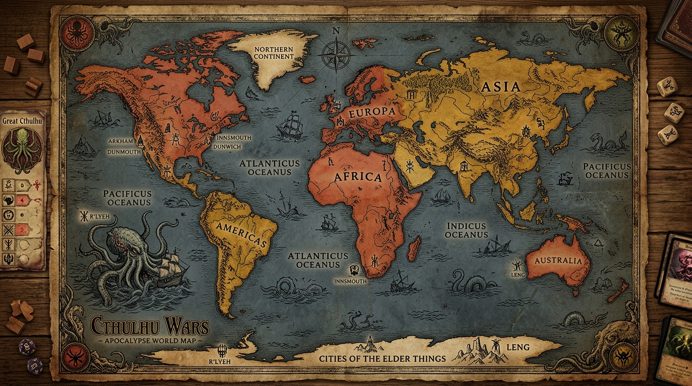
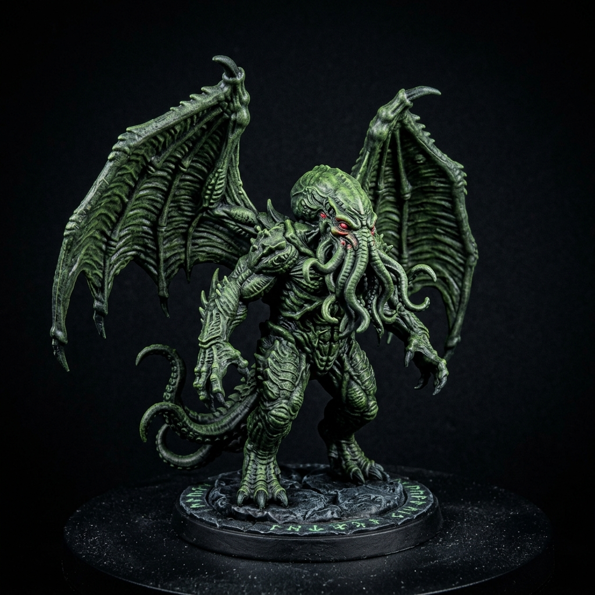
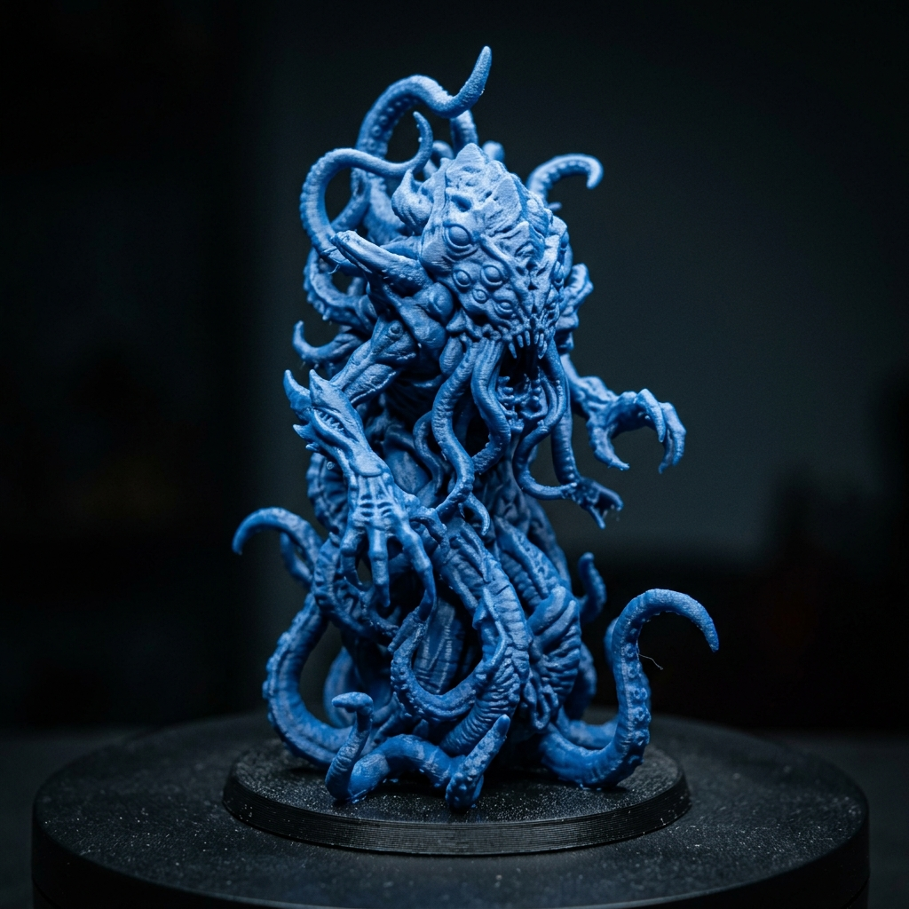
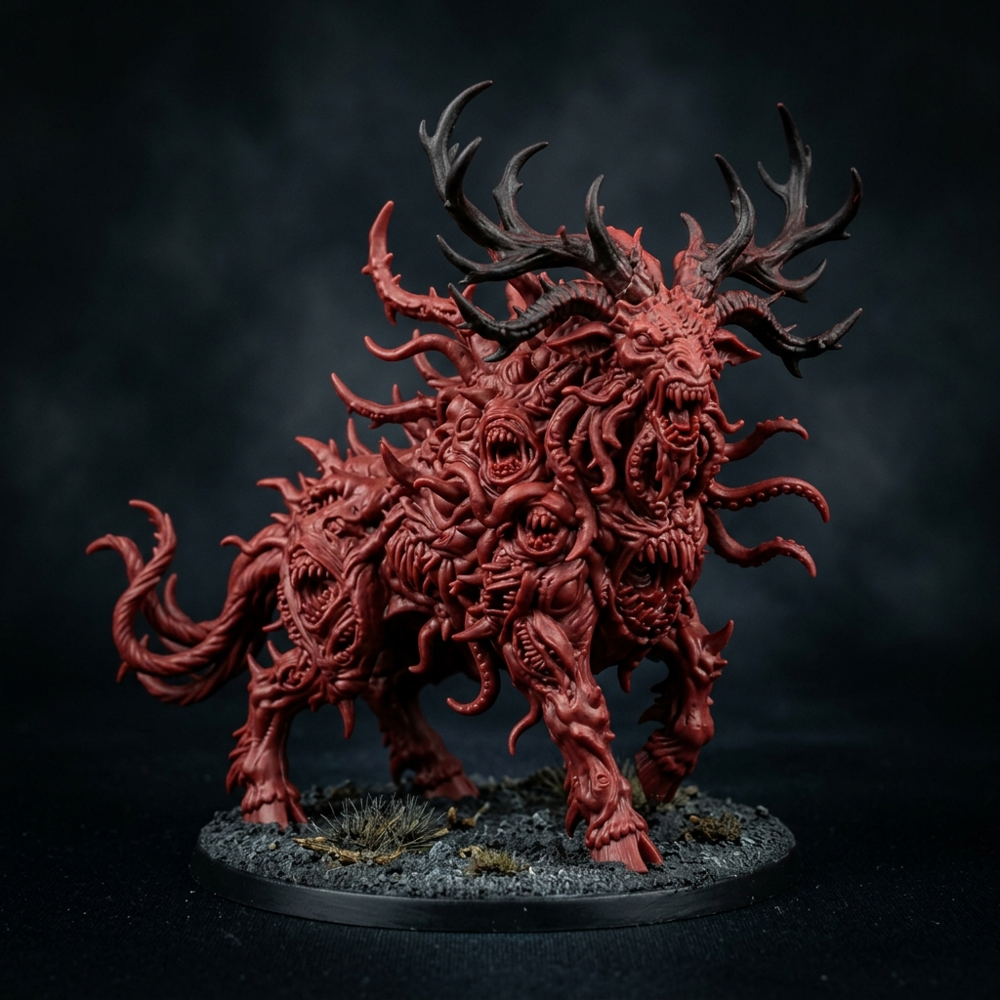
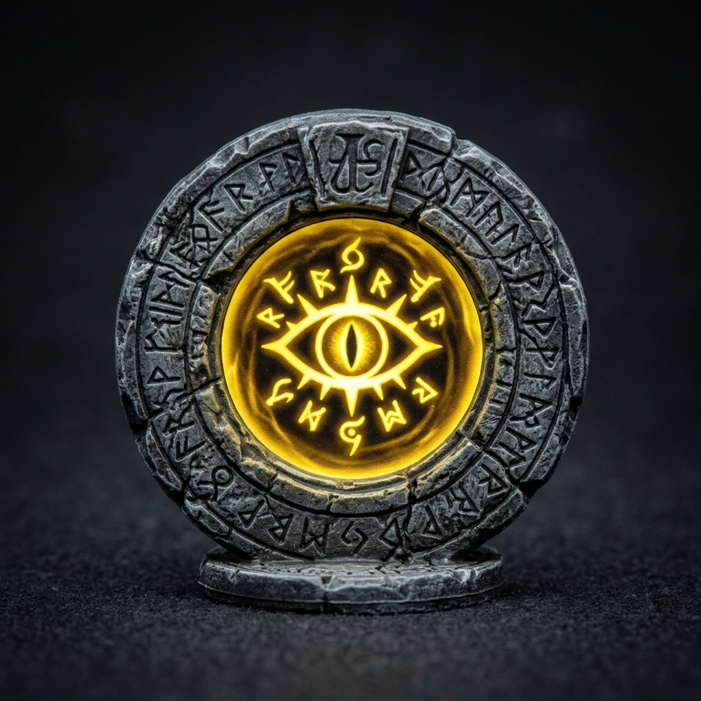
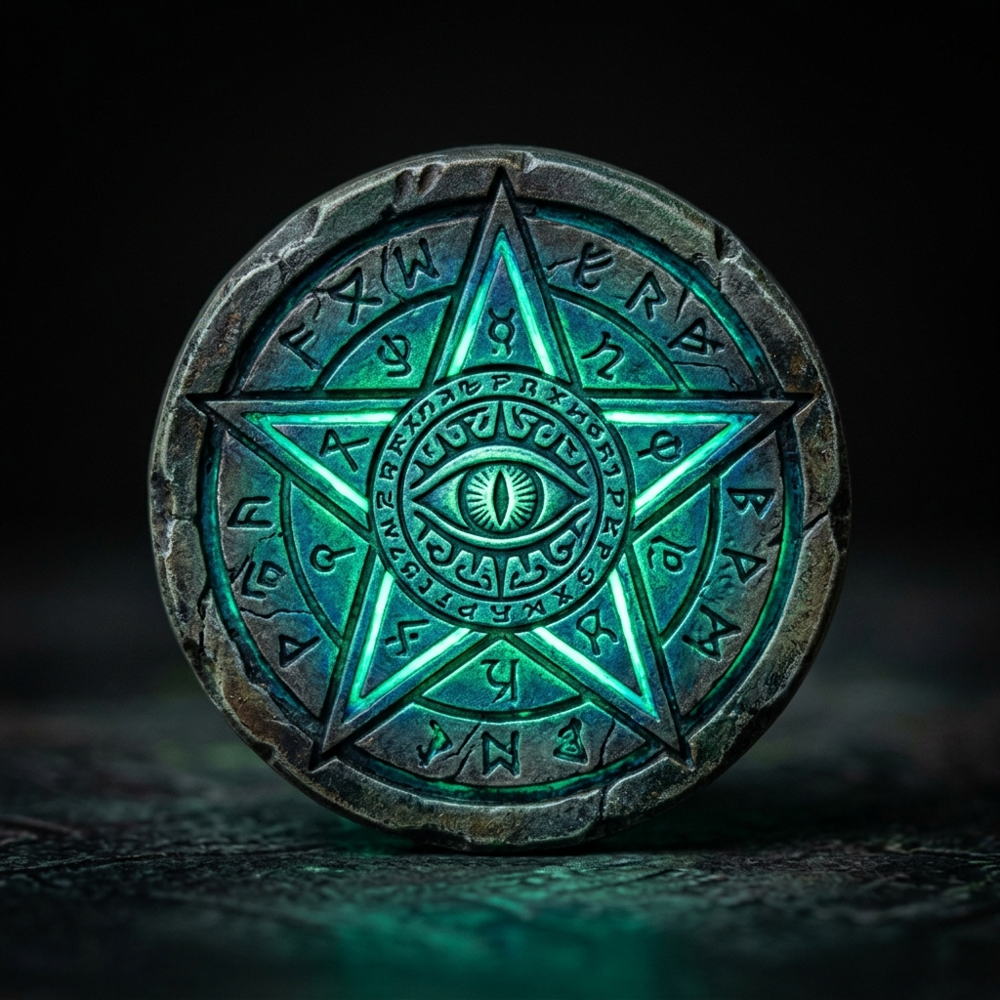
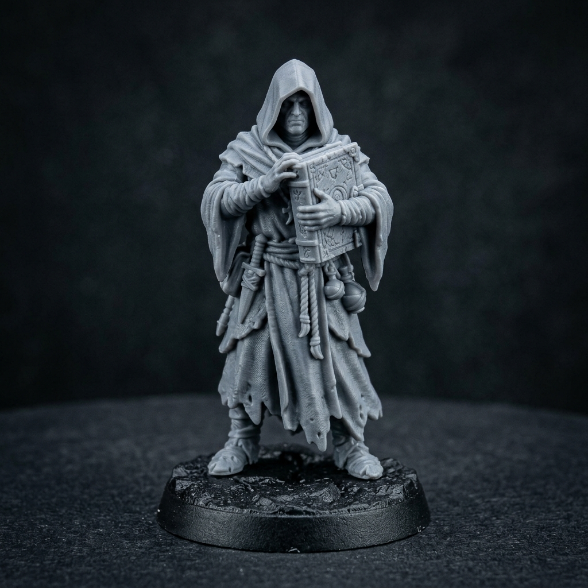

# 🐙 Cthulhu Wars — Digital Web Adaptation with Solana Web3

[](https://vitejs.dev/)
[](https://solana.com/)
[](LICENSE)

A web-based digital implementation of the asymmetric cosmic horror strategy board game **Cthulhu Wars** (originally designed by Sandy Petersen), featuring Tabletop Simulator-style artwork, interactive map topology, 4 core factions, full turn phase automation, and **Solana Web3 wallet integration**.

---

## 📸 Screenshots & Artwork

### 🗺️ Antique Eldritch World Map


### 👾 3D Miniature Tokens & Components

| Great Cthulhu | Crawling Chaos | Yellow Sign | Black Goat |
| :---: | :---: | :---: | :---: |
|  |  |  |  |
| **Great Cthulhu** | **Nyarlathotep** | **Hastur** | **Shub-Niggurath** |

| Eldritch Gate Token | Elder Sign Star Token | Cultist Miniature |
| :---: | :---: | :---: |
|  |  |  |

---

## 🌟 Key Features

* **🎨 Tabletop Simulator Aesthetic**: High-resolution antique parchment world map background, 3D plastic miniature tokens with faction color glow rings, and stone portal gate markers.
* **⚙️ Complete Phase Engine**:
  * **Gather Power Phase**: Calculates Power points for Cultists (+1), Controlled Gates (+2), Abandoned Gates (+1), and enforces the half-power catch-up rule.
  * **First Player Phase**: Dynamically awards initiative to the highest-power player.
  * **Action Phase**: Sequential turns for 8 actions (`MOVE`, `BUILD GATE`, `RECRUIT`, `SUMMON`, `AWAKEN`, `CAPTURE`, `BATTLE`, `PASS`).
  * **Doom Phase**: Auto-scores Gate Doom points, handles Ritual of Annihilation progression, draws Elder Signs, and enforces the 30-Doom victory threshold.
* **🎲 Interactive Combat Engine**: Simulates combat dice pools per unit battle value, resolving Kills (6), Pains (4-5), and Misses (1-3) with automated loss assignment and retreat routing.
* **⚡ Solana Web3 Integration**: Phantom, Solflare, and Backpack wallet login support, on-chain player stats tracking (ELO, Win Rate %, Doom points scored), and Quick Play local game launcher.
* **📜 In-Game Rulebook Overlay**: Interactive rulebook modal accessible anytime during gameplay.

---

## 🎮 How to Play

### 🏆 Winning the Game
To win, a player must fulfill **BOTH** requirements:
1. Reach **30 Doom Points** (or hold the highest score when the Doom pool runs out).
2. Unlock **ALL 6 Faction Spellbooks**.

### 🕹️ Action Phase Commands

| Action | Cost | Description |
| :--- | :--- | :--- |
| **`🚶 MOVE`** | 1 Power / unit | Select source region -> select units in modal -> click highlighted destination region. |
| **`🏗️ BUILD GATE`** | 3 Power | Construct an Eldritch Gate in a region where you have a Cultist and no gate. |
| **`👤 RECRUIT`** | 1 Power | Recruit 1 Cultist from your pool to a controlled Gate. |
| **`👹 SUMMON`** | 1–3 Power | Summon Monsters (Deep Ones, Nightgaunts, Byakhee, Mi-Go) at a controlled Gate. |
| **`🐙 AWAKEN`** | 10 Power | Awaken your Great Old One (Cthulhu, Nyarlathotep, Hastur, Shub-Niggurath). |
| **`🔗 CAPTURE`** | 1 Power | Capture an undefended enemy Cultist in a territory where you have a Monster or GOO. |
| **`⚔️ BATTLE`** | 1 Power | Initiate dice-rolling combat against enemies in the same region. |
| **`⏭️ PASS`** | 0 Power | Pass remaining turns for the current round. |

---

## 🛠️ Tech Stack & Architecture

* **Frontend**: HTML5, Vanilla JavaScript (ES Modules), Vite.
* **Styling**: Vanilla CSS3 (Glassmorphism, custom CSS variables, CSS grid/flex layout).
* **Graphics**: SVG Map Engine with `<polygon>` territory paths, vector glow filters, and texture overlays.
* **Web3 / Solana**: Solana Web3.js, Wallet Adapter, LocalStorage Profile Store.

```
cthulhu-wars/
├── index.html                  # HTML Shell & Modal Containers
├── package.json                # Dependencies & Build Scripts
├── docs/                       # Screenshots, Manual, & Conversation Records
│   ├── GAMEPLAY_GUIDE.md       # Comprehensive Rulebook & Technical Manual
│   ├── CONVERSATION_SUMMARY.md # Architecture & Session History
│   └── screenshots/            # High-Res Board & Miniature Assets
├── public/                     # Static Web Assets
│   └── assets/                 # Board textures, unit miniatures, gate tokens
└── src/
    ├── main.js                 # App Bootstrapper & Main Game Loop
    ├── css/                    # Main, Map, UI, Wallet, & Animation Styles
    ├── game/                   # Game Engine, State Machine, Combat, & Phases
    ├── solana/                 # Wallet Manager, Player Store, & Lobby Setup
    └── ui/                     # UI Controller, Setup Screen, & Action Bar
```

---

## 🚀 Quick Start & Installation

```bash
# Clone the repository
git clone https://github.com/sp3aker2020/cthulhu-wars.git
cd cthulhu-wars

# Install dependencies
npm install

# Start local development server
npm run dev
```

Open **`http://localhost:5173/`** in your browser to start playing!

---

## 📄 License

Distributed under the MIT License. See `LICENSE` for details.
