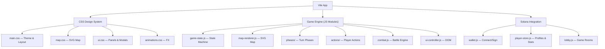

# Cthulhu Wars — Solana Web Game

A fully playable, visually stunning web implementation of the Cthulhu Wars board game with **Solana wallet authentication** and player tracking. 2–4 players, desktop-first, designed for eventual online multiplayer.

## User Review Required

> [!IMPORTANT]
> **Solana Integration Scope**: For Phase 1, wallet login uses direct provider detection (`window.solana` / Wallet Standard) — no heavy SDK needed. Player stats are stored in **localStorage** keyed by wallet address. Phase 3 upgrades to on-chain player profiles via a Solana program and adds real-time multiplayer via WebSocket server.

> [!WARNING]
> **Copyright**: Cthulhu Wars is a commercial product by Petersen Games. This implementation is for personal/educational use only. All artwork will be originally generated.

## Open Questions

1. **Player Stats Storage (Phase 1)**: LocalStorage is fine for a single-device MVP, but stats won't persist across devices. Should we add a lightweight backend (e.g., Firebase/Supabase) in Phase 1, or defer to Phase 3?
2. **On-Chain Scope (Phase 3)**: For on-chain player profiles, do you want just stats (wins/losses/elo), or also things like NFT trophies, token rewards, or entry fees?
3. **Wallet Support**: Plan supports Phantom, Solflare, and Backpack. Any others you want?

---

## Architecture Overview



**Tech Stack**:
- **Build**: Vite (vanilla JS, ES modules)
- **Rendering**: SVG for interactive map, DOM for UI
- **Styling**: Vanilla CSS with custom properties, glassmorphism, animations
- **Wallet**: Direct provider detection (Phantom `window.solana`, Solflare `window.solflare`, Wallet Standard)
- **Data**: localStorage for Phase 1 player stats → Solana on-chain program in Phase 3
- **Multiplayer (Phase 3)**: WebSocket server for real-time game sync

**Visual Style**: Dark eldritch Lovecraftian theme. Deep ocean blacks (`#0a0e17`), cosmic purples, bioluminescent greens. Glassmorphism panels with `backdrop-filter`. Google Fonts: Cinzel (headings), Inter (body). Smooth micro-animations throughout. Faction-colored glows (Green/Blue/Yellow/Red).

---

## Proposed Changes

### Phase 1: Playable Core Game + Wallet Auth

Delivers a **fully playable 2–4 player hot-seat game** with Solana wallet login and player stat tracking. All core game mechanics work. Spellbook abilities are displayed but not yet functional (unlock tracking only).

---

#### Project Setup

```
cthulhu-wars/
├── index.html
├── vite.config.js
├── package.json
├── public/
│   └── fonts/                    # Self-hosted fonts if needed
├── src/
│   ├── main.js                   # Entry point
│   ├── css/
│   │   ├── main.css              # Design system, variables, reset
│   │   ├── map.css               # SVG map styles
│   │   ├── ui.css                # Panels, modals, faction sheets
│   │   ├── wallet.css            # Wallet connect UI
│   │   └── animations.css        # Keyframes & transitions
│   ├── solana/
│   │   ├── wallet.js             # Wallet detection, connect, sign, disconnect
│   │   ├── player-store.js       # Player profiles & stats (localStorage)
│   │   └── lobby.js              # Game room creation, player slots
│   ├── game/
│   │   ├── constants.js          # Factions, map, units, all game data
│   │   ├── game-state.js         # Central state machine
│   │   ├── map-renderer.js       # SVG map rendering & interaction
│   │   ├── combat.js             # Dice rolling & battle resolution
│   │   ├── dice-renderer.js      # Visual dice animation
│   │   ├── phases/
│   │   │   ├── gather-power.js   # Phase 1: Power calculation
│   │   │   ├── first-player.js   # Phase 2: First player selection
│   │   │   ├── action-phase.js   # Phase 3: Action loop
│   │   │   └── doom-phase.js     # Phase 4: Doom & ritual
│   │   └── actions/
│   │       ├── move.js
│   │       ├── battle.js
│   │       ├── build-gate.js
│   │       ├── recruit.js
│   │       ├── summon.js
│   │       ├── awaken.js
│   │       ├── capture.js
│   │       └── ritual.js
│   ├── ui/
│   │   ├── ui-controller.js      # Master UI coordinator
│   │   ├── setup-screen.js       # Wallet login + faction select
│   │   ├── faction-panel.js      # Right sidebar (power, doom, units)
│   │   ├── action-bar.js         # Bottom action buttons
│   │   ├── combat-modal.js       # Combat resolution UI
│   │   ├── phase-banner.js       # Phase transition overlay
│   │   ├── game-log.js           # Event log
│   │   └── end-screen.js         # Final scores & winner
│   └── utils/
│       ├── events.js             # Event emitter
│       ├── dom.js                # DOM helpers
│       └── random.js             # Dice, shuffles
└── assets/
    └── (generated faction art)
```

---

### Solana Integration Layer

#### [NEW] `src/solana/wallet.js`
Wallet connection manager supporting multiple Solana wallets:

```
Responsibilities:
- Detect installed wallets (Phantom, Solflare, Backpack) via provider injection
- Wallet Standard support for newer wallets
- Connect / disconnect flow
- Sign message for authentication (prove wallet ownership)
- Emit events: 'connected', 'disconnected', 'accountChanged'
- Store connection state
- Auto-reconnect on page reload (if previously approved)
```

Key API:
- `getAvailableWallets()` → `[{name, icon, provider}]`
- `connect(walletName)` → `{publicKey, signMessage}`
- `disconnect()`
- `signMessage(message)` → `{signature}` (used for auth verification)
- `getPublicKey()` → `string | null`
- `onConnect(callback)`, `onDisconnect(callback)`

Detection logic:
- Phantom: `window.solana?.isPhantom` or `window.phantom?.solana`
- Solflare: `window.solflare?.isSolflare`
- Backpack: `window.backpack`
- Wallet Standard: `navigator.wallets?.get()`

#### [NEW] `src/solana/player-store.js`
Player profile and statistics manager:

```
Responsibilities:
- Create/load player profile keyed by wallet public key
- Track stats: gamesPlayed, wins, losses, totalDoomScored, favoriteFaction, lastPlayed
- Persist to localStorage (Phase 1) → Solana program (Phase 3)
- Leaderboard data aggregation (local device only in Phase 1)
```

Data model:
```js
PlayerProfile = {
  walletAddress: string,        // Solana public key (base58)
  displayName: string,          // Optional nickname
  stats: {
    gamesPlayed: number,
    wins: number,
    losses: number,
    totalDoomScored: number,
    highestDoom: number,
    favoriteFaction: string,
    factionWins: { cthulhu: 0, crawlingChaos: 0, yellowSign: 0, blackGoat: 0 },
    lastPlayed: timestamp
  },
  createdAt: timestamp
}
```

#### [NEW] `src/solana/lobby.js`
Game room/lobby system:

```
Responsibilities:
- Create a new game room (host picks player count 2-4)
- Player slots: each slot filled by a wallet-connected player
- Faction selection per slot (no duplicates)
- "Ready" state per player
- Start game when all players ready
- Phase 1: all players on same device (hot-seat), wallets just identify them
- Phase 3: WebSocket rooms for online play
```

---

### Wallet Connect UI Flow

#### [NEW] `src/ui/setup-screen.js`

**Screen 1: Title & Wallet Connect**
```
┌─────────────────────────────────────────────┐
│                                             │
│          🐙 CTHULHU WARS 🐙                │
│       The Stars Are Right                   │
│                                             │
│    ┌───────────────────────────────┐        │
│    │  🟣 Connect Phantom Wallet   │        │
│    ├───────────────────────────────┤        │
│    │  🟠 Connect Solflare         │        │
│    ├───────────────────────────────┤        │
│    │  🔵 Connect Backpack         │        │
│    └───────────────────────────────┘        │
│                                             │
│    Connected: 7xKf...3mPq  ✅              │
│    Player Stats: 12 games | 5 wins          │
│                                             │
└─────────────────────────────────────────────┘
```

**Screen 2: Game Lobby**
```
┌─────────────────────────────────────────────┐
│  GAME LOBBY           Players: 2/4          │
│                                             │
│  Slot 1: 7xKf...3mPq  [Great Cthulhu ▼] ✅│
│  Slot 2: 9bRt...7nWx  [Crawling Chaos ▼] ✅│
│  Slot 3: [Connect Wallet]                   │
│  Slot 4: [Connect Wallet]                   │
│                                             │
│         [ START GAME (2 players) ]          │
└─────────────────────────────────────────────┘
```

---

### Game UI Layout (Desktop-First)

#### [NEW] `index.html`

```
┌──────────────────────────────────────────────────────────┐
│ HEADER BAR                                               │
│ Round 3 │ Phase: Action │ Current: 7xKf...(Cthulhu) │ ⚙ │
├────────────────────────────────┬─────────────────────────┤
│                                │  FACTION PANEL          │
│                                │  ┌─────────────────┐   │
│                                │  │ Great Cthulhu    │   │
│     INTERACTIVE SVG MAP        │  │ Power: ████░ 12  │   │
│     (13 regions, ~70% width)   │  │ Doom:  ██░░░  8  │   │
│                                │  ├─────────────────┤   │
│     [regions with units,       │  │ Units on Map:    │   │
│      gates, faction colors,    │  │  6× Cultist      │   │
│      click to select]          │  │  2× Deep One     │   │
│                                │  │  1× Shoggoth     │   │
│                                │  │  🔴 Cthulhu      │   │
│                                │  ├─────────────────┤   │
│                                │  │ Spellbooks: 3/6  │   │
│                                │  │ ✅ Devolve       │   │
│                                │  │ ✅ Dreams        │   │
│                                │  │ ✅ Y'ha-nthlei   │   │
│                                │  │ ☐ Absorb         │   │
│                                │  │ ☐ Submerge       │   │
│                                │  │ ☐ Regeneration   │   │
│                                │  └─────────────────┘   │
├────────────────────────────────┴─────────────────────────┤
│ ACTION BAR                                               │
│ [🚶Move] [⚔Battle] [🏗Gate] [👤Recruit] [👹Summon]     │
│ [🐙Awaken] [🔗Capture] [💀Ritual] [⏭Pass]              │
├──────────────────────────────────────────────────────────┤
│ GAME LOG                                                 │
│ > Cthulhu moved 2 Deep Ones from S.Pacific to Australia  │
│ > Yellow Sign built a gate in North America              │
└──────────────────────────────────────────────────────────┘
```

---

### Core Game Engine

*(Same as previous plan — full details below)*

#### [NEW] `src/game/constants.js`
All static game data:
- **4 Factions**: Great Cthulhu (green), Crawling Chaos (blue), Yellow Sign (yellow), Black Goat (red)
- **Unit rosters** with pool counts, summon costs, combat dice
- **Great Old Ones** with awakening costs, combat values, requirements
- **Spellbook definitions** (names, unlock conditions, descriptions — effects in Phase 2)
- **13 Map Regions** with type (land/ocean) and adjacency graph
- **Game config**: starting power (8), gate cost (3), ritual track (5→10), doom threshold (30)

#### [NEW] `src/game/game-state.js`
Event-driven state machine:
- Game state: round, phase, first player, turn order, ritual track, game over
- Per-player: wallet address, faction, power, doom, elder signs, gates, units (map + pool), captured cultists, spellbooks unlocked, has passed
- Map state: per-region gates and unit positions
- `dispatch(action)` with validation → state update → event emission
- Action legality checking for UI button enable/disable
- Undo-friendly (action log for eventual multiplayer sync)

#### [NEW] `src/game/map-renderer.js`
Interactive SVG world map:
- 13 hand-crafted SVG region paths (stylized continents + oceans)
- Faction-colored unit tokens rendered as SVG groups within regions
- Gate markers as pulsing animated circles
- Click handling: select source region → highlight valid targets → confirm
- Hover states with region info tooltips
- Adjacency lines on hover
- Responsive scaling with viewBox

#### [NEW] `src/game/combat.js`
Battle resolution:
- Dice pool calculation (sum unit combat values)
- Special combat values: Cthulhu's Devour (pre-roll kill), dynamic combat (Nyarlathotep, Hastur, Shub-Niggurath)
- Roll resolution: 6=Kill, 4-5=Pain, 1-3=Miss
- Kill assignment UI (player picks own units to die)
- Pain/retreat UI (pick adjacent region, validate no-enemy rule)
- If no legal retreat → forced kill

#### [NEW] `src/game/dice-renderer.js`
Animated dice visualization:
- CSS 3D-transform tumbling dice
- Color-coded results: red glow (Kill), amber pulse (Pain), dim gray (Miss)
- Sequential dramatic reveal
- Integrated into combat modal

#### [NEW] `src/game/phases/` (4 files)
- **gather-power.js**: Power = cultists + (2×gates) + abandoned gates + returned captives. Half-power catch-up rule.
- **first-player.js**: Highest power gets token. Tie-breaking. Choose turn direction.
- **action-phase.js**: Turn loop, action delegation, pass management, all-passed detection.
- **doom-phase.js**: Auto-score gates. Ritual of Annihilation offers. Game end check.

#### [NEW] `src/game/actions/` (8 files)
Each action module: validate legality → show UI for target selection → execute → update state.
- **move.js**: Select units → select adjacent destination → pay 1/unit
- **battle.js**: Select region → trigger combat modal → resolve
- **build-gate.js**: Select region (cultist present, no gate) → place gate → pay 3
- **recruit.js**: Select region (friendly units present) → place cultist → pay 1
- **summon.js**: Select monster type → select controlled gate → pay cost
- **awaken.js**: Check requirements → select gate → place GOO → pay cost
- **capture.js**: Select unprotected enemy cultist → capture → pay 1
- **ritual.js**: Pay ritual cost → advance track → score doom → draw elder signs

---

### UI Components

#### [NEW] `src/ui/ui-controller.js`
Master coordinator — subscribes to game state events and delegates rendering to component modules.

#### [NEW] `src/ui/faction-panel.js`
Right sidebar showing active player's faction:
- Animated power bar (glowing fill)
- Doom score counter
- Unit roster (on map vs in pool)
- Spellbook checklist with lock/unlock icons
- Captured cultists display

#### [NEW] `src/ui/action-bar.js`
Bottom action buttons:
- Icon + label buttons for each action
- Disabled state when action is illegal (gray + tooltip explaining why)
- Power cost shown on each button
- Highlight available actions with subtle pulse

#### [NEW] `src/ui/combat-modal.js`
Full-screen overlay for battle resolution:
- Split view: attacker (left) vs defender (right)
- Unit lists for each side with combat values
- Animated dice rolling area
- Kill assignment phase (click units to assign kills)
- Pain/retreat phase (click regions on map to retreat)
- Results summary

#### [NEW] `src/ui/phase-banner.js`
Phase transition: full-width animated banner slides across screen announcing the new phase.

#### [NEW] `src/ui/game-log.js`
Scrollable bottom panel logging all game events with faction-colored text.

#### [NEW] `src/ui/end-screen.js`
Game over modal:
- Elder sign reveal animation
- Final doom totals per player
- Spellbook completion check (disqualification warning)
- Winner announcement with faction art
- Player stats update
- "Play Again" / "Return to Lobby" buttons

---

### Phase 2: Spellbooks & Faction Abilities

- Implement all **24 spellbook effects** (6 per faction)
- Automated spellbook unlock detection (condition monitoring)
- Crawling Chaos: Flight (2-area movement), Abduct, Invisibility, Madness, Seek and Destroy, Thousand Forms
- Great Cthulhu: Absorb, Devolve, Dreams, Submerge/Emerge, Y'ha-nthlei, Regeneration
- Yellow Sign: Desecrate system, Screaming Dead, Shriek of Byakhee, He Who is Not to be Named, Passion, Zingaya
- Black Goat: Thousand Young cost reduction, Frenzy, Red Sign, Necrophagy, Sacrifice, Blood Sacrifice
- Dynamic combat values (Nyarlathotep = total spellbooks, Hastur = ritual cost, Shub = gates + cultists)
- Elder Sign pool with hidden random values (1/2/3)
- Hastur's dual-GOO system (King in Yellow + Hastur)

---

### Phase 3: Online Multiplayer & On-Chain

#### Real-Time Multiplayer
- **WebSocket server** (Node.js) for game room management
- Real-time state sync between connected wallet players
- Turn enforcement server-side (prevent cheating)
- Reconnection handling
- Spectator mode
- Matchmaking queue

#### On-Chain Solana Program
- **Player profile program**: Store wins/losses/elo on-chain tied to wallet
- **Leaderboard**: Global ranking by elo
- **Optional**: NFT trophies for achievements (first win, 100 games, etc.)
- **Optional**: Token-gated entry fees / prize pools

#### Additional Polish
- Sound effects and ambient Lovecraftian music
- Save/load game state
- Expanded 5-player map (21 regions)
- Tutorial/how-to-play overlay
- Mobile responsive adaptation
- AI opponents (heuristic-based)

---

## Verification Plan

### Manual Verification
- Full 4-player game playthrough to validate all actions
- Wallet connect/disconnect flow on Phantom + Solflare
- Player stats persistence across page reloads
- Edge cases: 0-power auto-pass, no-retreat forced kill, abandoned gate control
- Power calculation accuracy
- Doom scoring and game end triggers
- Combat with all unit types

### Automated Tests
```bash
# Run via Vite's test runner (vitest)
npx vitest run
```
- Combat resolution unit tests (dice, kills, pains)
- Power calculation unit tests
- Action legality validation tests
- Adjacency graph correctness tests
- Player store CRUD tests
